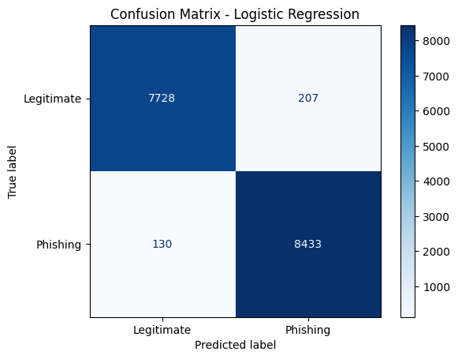

# Phishing Email Detection using Machine Learning

This project focuses on detecting phishing emails using classical machine learning techniques and natural language processing (NLP). Multiple models were trained and evaluated, with **Logistic Regression** selected as the final model due to its strong performance, interpretability, and suitability for security-focused applications.

## 📂 Dataset
This project uses the **Phishing Email Dataset from Kaggle**.

⚠️ The dataset is not included in this repository due to GitHub’s 100 MB file size limit.

### Running the Project Locally
1. Clone this repository 
```bash
git clone https://github.com/minhanh0503/phishingemail_detector.git
cd phishingemail_detector
```
2. Download the dataset CSV file from Kaggle  
3. Place the file in the project directory as:
 phishingemail_detector/phishing_email.csv

## 🧠 Feature Engineering
- Text preprocessing and cleaning
- TF-IDF vectorization with unigrams and bigrams
- High-dimensional sparse feature representation

## 🤖 Models Trained
- Logistic Regression (Final Model)
- Naive Bayes
- Random Forest
- Support Vector Machine (SVM)
- XGBoost (used for performance comparison)

## ⚙️ Final Model Configuration
- Solver: LBFGS
- Regularization: L2
- Max Iterations: 1000
- Feature Representation: TF-IDF

## 📊 Model Evaluation

The Logistic Regression model was evaluated using a held-out test set. Performance was measured using precision, recall, F1-score, and confusion matrix analysis.

### Evaluation Metrics
- **Precision**: Measures how many emails flagged as phishing were actually phishing  
- **Recall**: Measures how many phishing emails were correctly detected  
- **F1-score**: Balances precision and recall  

In phishing detection, **recall is particularly important**, as false negatives (missed phishing emails) pose a higher security risk than false positives.

### Confusion Matrix Results

- **True Positives (TP): 8,433** – phishing emails correctly identified  
- **False Positives (FP): 207** – legitimate emails incorrectly flagged  
- **True Negatives (TN): 7,728** – legitimate emails correctly identified  
- **False Negatives (FN): 130** – phishing emails missed  

Out of **16,498 emails**, the model made **337 misclassifications**, corresponding to a very low error rate. Importantly, the number of false negatives is minimal, reducing the risk of phishing emails bypassing detection while maintaining an acceptable false-positive rate.

Overall, the model achieves a strong balance between security effectiveness and user experience while remaining interpretable and efficient.

## 🔎 Feature Interpretation

One advantage of using Logistic Regression is its interpretability. By analyzing model coefficients, we can identify which words most strongly influence phishing predictions.

### Top Phishing Indicators
The model assigns higher weights to words commonly associated with phishing and spam emails, such as:
- `http`, `click`, `site`
- `account`, `bank`, `money`, `investment`
- `viagra`, `meds`, `replica`, `watches`

These terms reflect common phishing tactics including malicious links, financial scams, and spam content.

### Legitimate Email Indicators
Words with negative weights are more strongly associated with legitimate emails, including:
- `university`, `python`, `perl`, `opensuse`
- `thanks`, personal names, and conversational terms

This demonstrates that the model captures meaningful linguistic patterns rather than relying on superficial features.

## 🚀 Streamlit Demo

A simple Streamlit web application allows users to paste email content and receive real-time phishing predictions using the trained Logistic Regression model.

<!-- ### Running the Demo Locally
```bash
pip install -r requirements.txt
streamlit run app.py
``` -->

## 🛠️ Tech Stack
- Python
- scikit-learn
- Pandas
- NumPy
- Matplotlib
- Jupyter Notebook
